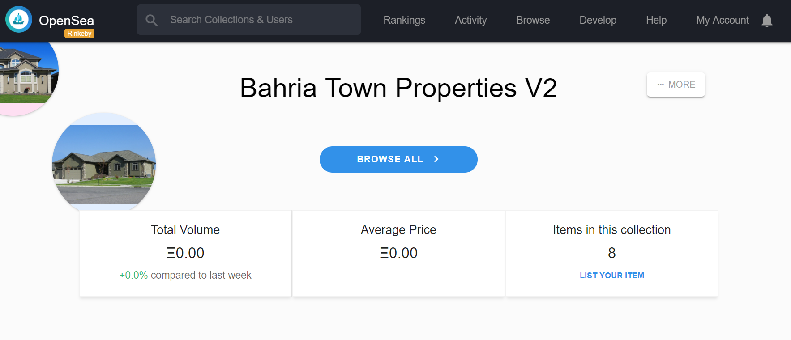

# Real Estate Marketplace (ERC-721 based tokens on Ethereum platform)

ERC-721 based property tokens which can be traded on Markeplace.

# Tools Used

1. [Remix - Solidity IDE](https://remix.ethereum.org/)
2. [Visual Studio Code](https://code.visualstudio.com/)
3. [Truffle Framework](https://truffleframework.com/)
4. [Ganache - One Click Blockchain](https://truffleframework.com/ganache)
5. [Open Zeppelin ](https://openzeppelin.org/)
6. [Interactive zero knowledge 3-colorability demonstration](http://web.mit.edu/~ezyang/Public/graph/svg.html)
7. [Docker](https://docs.docker.com/install/)
8. [ZoKrates](https://github.com/Zokrates/ZoKrates)
9. [OpenSea](https://opensea.io/)
10. [MyEtherWallet](myetherwallet.com)
11. [Zero Knowledge Proof (Zokrates)](https://zokrates.github.io/)

# Getting started with project
In order to start develpment of SmartProperty token, you need to run `npm install` in project folder after cloning the repo.

# ZoKrates Process (zkSNARKs)

This is a 5 step process:

1. Compile Program
2. Trusted Setup
3. Compute-Witness
4. Generate-Proof
5. Export-Verifier

```
docker run -v <path-to-zokrates-code>:/home/zokrates/code -ti zokrates/zokrates:0.3.0 /bin/bash
cd code/square
~/zokrates compile -i square.code
~/zokrates setup [--proving-scheme pghr13]
~/zokrates compute-witness -a 2 4
~/zokrates generate-proof
~/zokrates export-verifier
```
Now copy verifier.sol in contracts folder and update solidity version  

# Testing Contracts
Run below command to test your contracts
`truffle test`


# Migrating on Ethereum network
Configuration for deployment on `rinkeby` network is added in `truffle-config.js` file.  
Run below command for deployment.  
`truffle migrate --network rinkeby`

### Contract Address
`https://rinkeby.etherscan.io/address/0x5b257bf2f057a5c20bbcb51e082ce21b05379170`


# OpenSea Marketplace
Token is listed on OpenSea market place
`https://rinkeby.opensea.io/category/bahriatownpropertiesv2`



